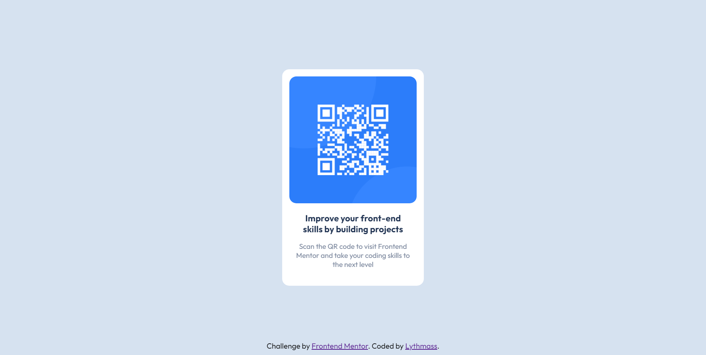

# Frontend Mentor - QR code component solution

This is a solution to the [QR code component challenge on Frontend Mentor](https://www.frontendmentor.io/challenges/qr-code-component-iux_sIO_H). Frontend Mentor challenges help you improve your coding skills by building realistic projects.

## Table of contents

- [Overview](#overview)
  - [Screenshot](#screenshot)
  - [Continued development](#continued-development)
- [Author](#author)

## Overview

     A Simple challenge project by Frontend Mentor was done by Lythmass using basic HTML and CSS. This project contains simple QR code image and few more texts.

### Screenshot

### Built with

- Semantic HTML5 markup
- CSS custom properties
- Flexbox

### Continued development

Using Flexbox for this project was very easy, but in general it is very important and complex element in CSS in my opinion, so I am going to refine this skill as much as I can.

## Author

- GitHub - [Lythmass](https://github.com/Lythmass)
- Frontend Mentor - [@Lythmass](https://www.frontendmentor.io/profile/Lythmass)
- Twitter - [@lythmass](https://twitter.com/lythmass)
